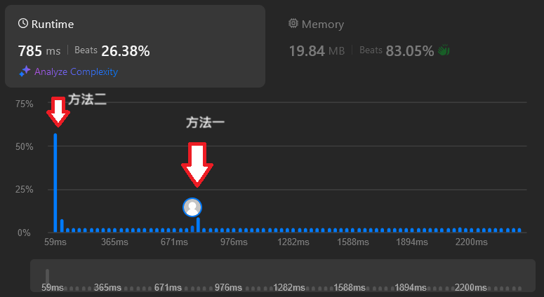

# [303. Range Sum Query - Immutable](https://leetcode.com/problems/range-sum-query-immutable/description/)

## 題目描述
Given an integer array nums, handle multiple queries of the following type:

* Calculate the sum of the elements of nums between indices left and right inclusive where left <= right.

Implement the NumArray class:

* NumArray(int[] nums) Initializes the object with the integer array nums.
* int sumRange(int left, int right) Returns the sum of the elements of nums between indices left and right inclusive (i.e. nums[left] + nums[left + 1] + ... + nums[right]).


## 解法1
* 這個方法，應該是最簡單的方法，直接照著題意寫。
* 但每次sumRange()時要從列表中的left一路加到right，所以一共要做right-left次，時間會稍久，調用sumRange()複雜度為O(right-left)
```python3
class NumArray:

    def __init__(self, nums: List[int]):
        self.arr = nums
        

    def sumRange(self, left: int, right: int) -> int:
        return sum(self.arr[left:right+1])
```

## 解法2
* 這個方法是在一開始，創建一個表它的第i項為，nums[0:i]的加總。
* 為了避免每次都要進行一次sum(nums[0:i])，所以改為arr[i] = arr[i-1] + nums[i]
  
| i   | 0   | 1    | 3     | 4        |
| ---- | ----- | ------ | --------- | -----|
| nums[i] | a   | b  | c | d  |
| sum(nums[0:i]) | a   | a+b  | a+b+c | a+b+c+d  |

* 當要知道left到right的加總，只需要將上表的right項 與 left的前一項相減，就是答案了。
* 如：sumRange(1,4)，要從nums第一項加到第四項，答案是b+c+d，所以只要將第4項[right]:(a+b+c+d) - 第0項[left-1]:(a)，就會試答案了。 
```python3
class NumArray:

    def __init__(self, nums: List[int]):
        self.arr = [nums[0]]
        for i in range(1,len(nums)):
            self.arr.append(self.arr[i-1] + nums[i])
        print(self.arr)
        

    def sumRange(self, left: int, right: int) -> int:
        if left == 0:
            return self.arr[right]
        else:
            return self.arr[right] - self.arr[left-1]
```


* 方法一 每次sumRange，都要加總一次，複雜度為O(right-left)。
* 方法二 在__init__時進行一次加總，後面每次調用sumRange，只要進行一次減法複雜度變為O(1)

