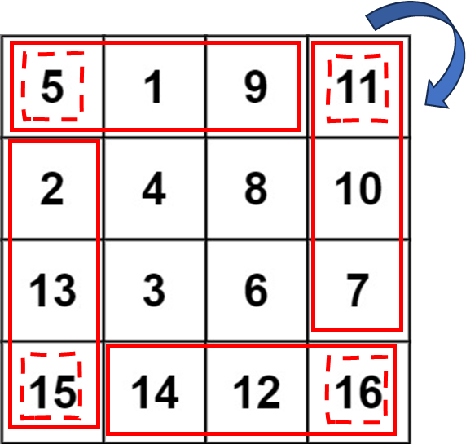

# [48. Rotate Image](https://leetcode.com/problems/rotate-image/description/?envType=study-plan-v2&envId=top-interview-150)

## 題目描述
* 將一個n*n矩陣旋轉90度

## 解法
* 每次將每個邊的每一格，逐次換到旋轉90度的位置
* 外迴圈，每次往內一個邊
* 內迴圈，逐次遍歷邊上的每一格，將四個邊上對應的點互換

```python3
class Solution:
    def rotate(self, matrix: List[List[int]]) -> None:
        """
        Do not return anything, modify matrix in-place instead.
        """
        n = len(matrix)
        for i in range(len(matrix)//2):
            for j in range(0,len(matrix)-1-2*i):
                matrix[i][i+j], matrix[i+j][n-i-1], matrix[n-i-1][n-i-1-j], matrix[n-i-1-j][i] = matrix[n-i-1-j][i], matrix[i][i+j], matrix[i+j][n-i-1], matrix[n-i-1][n-i-1-j]  
```
